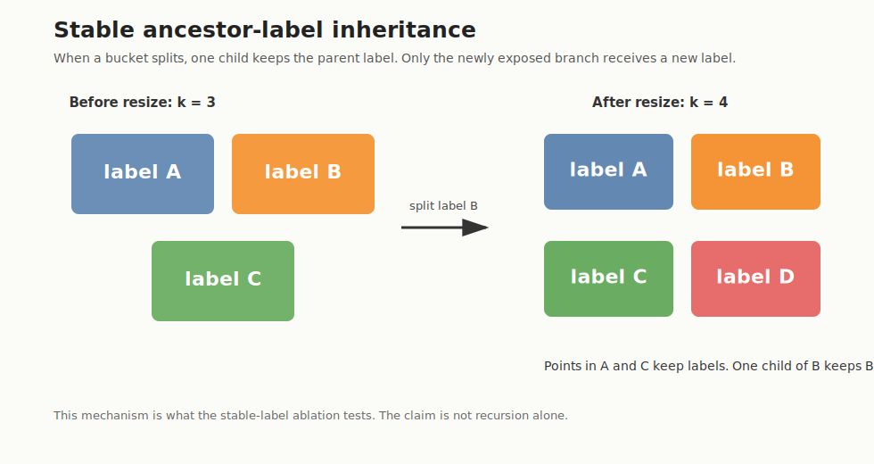
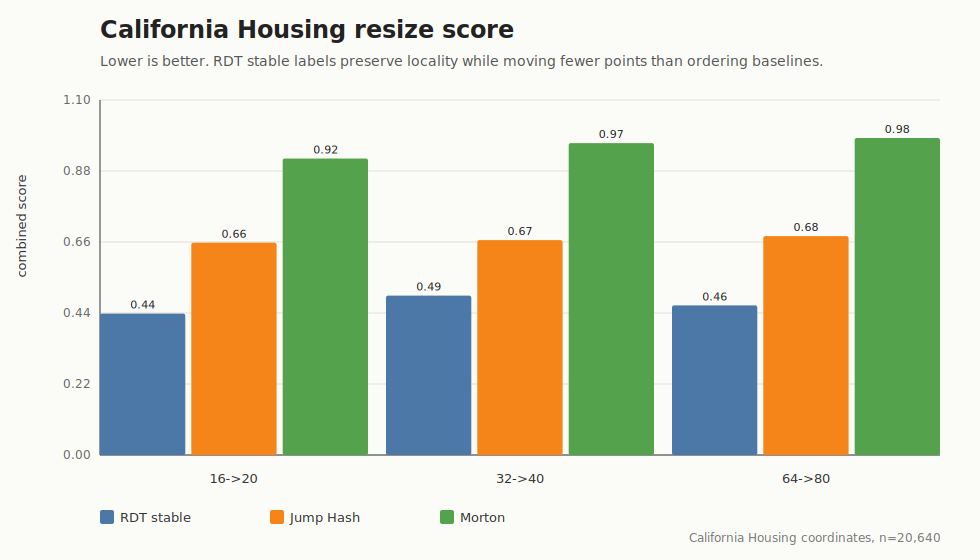
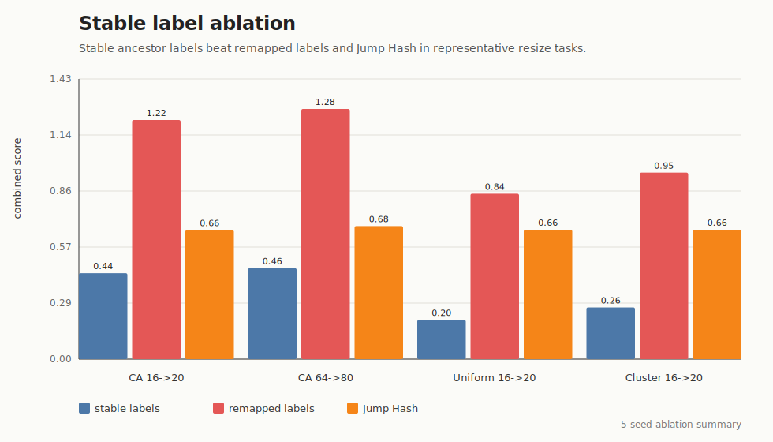
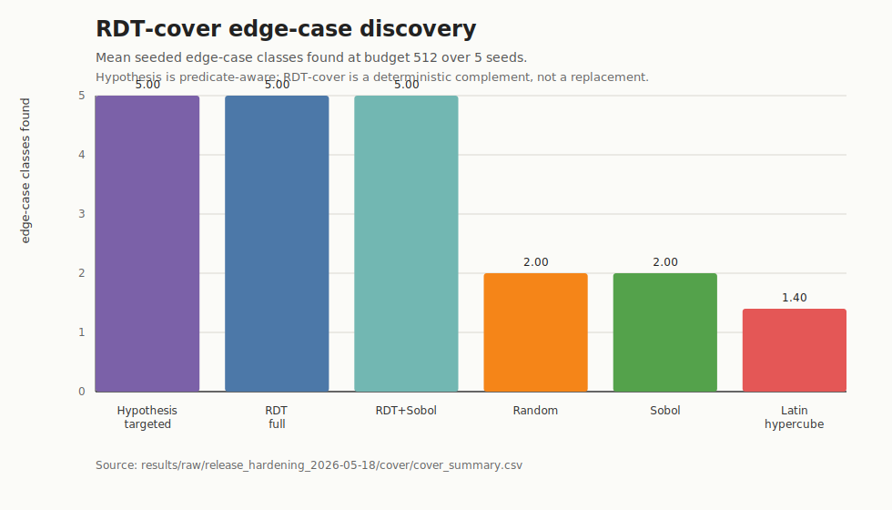
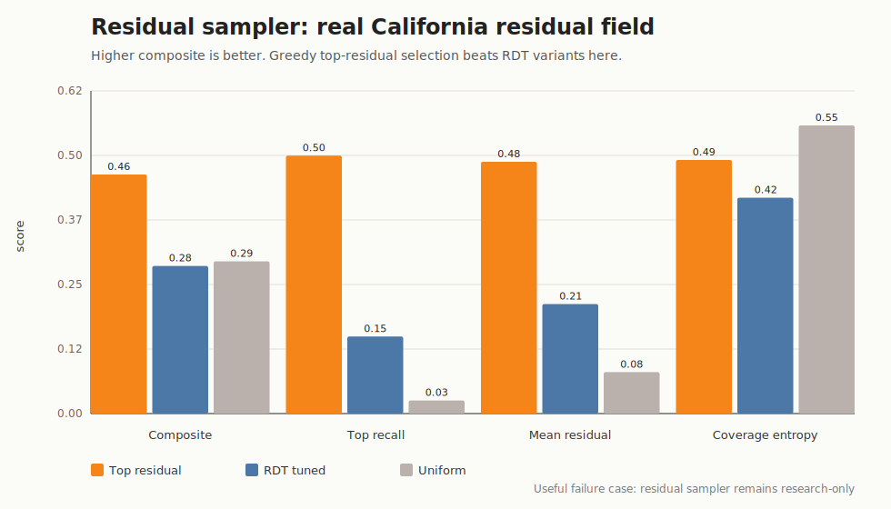
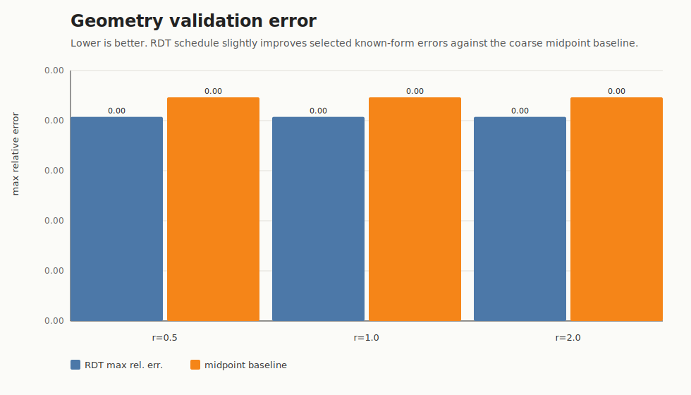
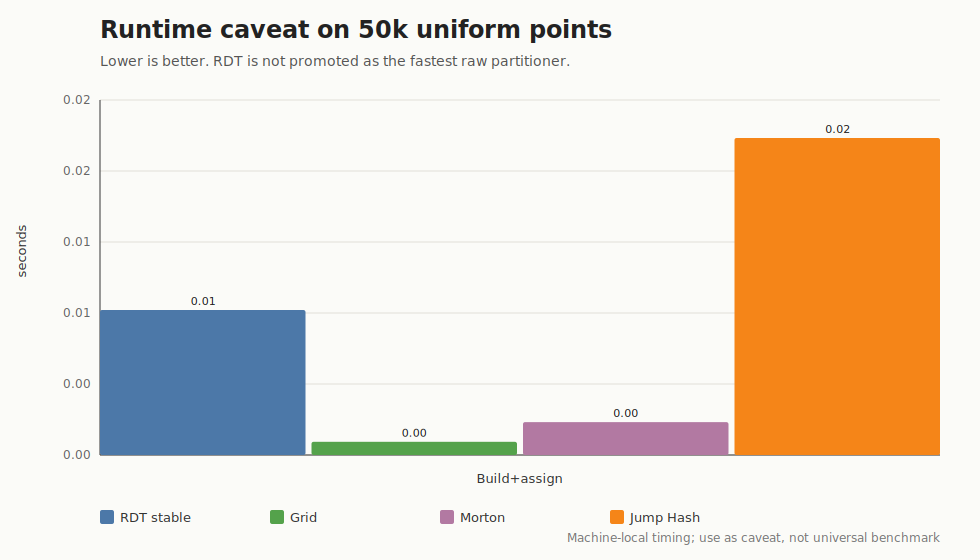

# Figure Index

The figures in this repo are meant to explain the mechanism and evidence, not to decorate the page. Each one supports a specific bounded claim or limitation.

## Stable Label Mechanism

This figure explains the core mechanism. When a labeled cell splits during resize, one child inherits the parent label and the other child gets a new label. The benchmark ablation tests whether this inheritance rule matters.

## Stable Partition: Real Data

This figure summarizes the California Housing coordinate benchmark. RDT stable labels have the best combined movement/locality/load score for the tested resize pairs. The figure supports a tradeoff claim, not a raw speed claim.

## Stable Label Ablation

This figure is the most important mechanism evidence. It compares stable labels with remapped labels, holding the recursive structure fixed. Stable labels win on the representative tasks shown.

## RDT-Cover Edge-Case Discovery

This figure shows how many seeded numerical edge-case classes were found by each coverage method. Hypothesis-targeted, full RDT, and hybrid RDT schedules found all five classes. Random, Sobol, and Latin hypercube found fewer in this benchmark. Hypothesis produced many more total hits because it uses the benchmark predicates directly. The supported claim is therefore narrower: RDT-cover is a deterministic edge-case schedule that beats blind/random coverage here, not a replacement for property-based testing.

## Residual Sampler Failure Case

This figure shows why residual sampling is marked research-only. On a real California Housing residual field, top-residual selection beats RDT-tuned selection.

## Geometry Validation Error

This figure shows the selected known-form geometry check. The result is small and bounded: RDT improves the included midpoint baseline slightly, but stronger numerical integration baselines are still needed.

## Runtime Caveat

This figure prevents overclaiming. RDT is not the fastest raw partitioner in current timing checks. The supported claim is about the movement/locality/load tradeoff.
